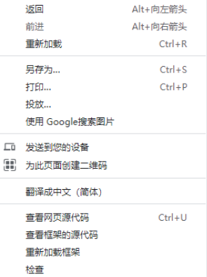

# GradeCrawler

这是华南理工大学基于综测系统数据的必修课成绩爬虫，以满足同学们对第二学期成绩以及整体成绩的直观了解。

## 免责声明

1. 该爬虫仅仅使用公开的数据，不存在恶意盗取学校隐私数据

2. 您能成功运行代表您有权限访问这部分数据

3. 使用本爬虫程序可能会对目标网站造成一定程度的访问压力。请在合理范围内使用，避免对目标网站造成过大的影响。

4. 本爬虫程序仅供个人学习和研究目的使用。请不要将其用于非法用途或未经授权的网站抓取。

5. 由于网站内容和结构的不断变化，本爬虫程序可能无法保证长期有效性和稳定性。用户需自行承担因此导致的数据不准确或缺失的风险。

6. 使用本爬虫程序即视为接受本免责声明。如果您不同意本声明的任何条款，请勿使用本爬虫程序。

## 使用环境

1. 校园网

2. vpn（注：webvpn无效）

## 使用方法

1.进入老版学生信息管理系统， http://xsgl.7i5q.cas.scut.edu.cn/sms2/homepage.jsp

**进到智育页面**

                 此时应确保页面存在有效数据

**获取Cookie**

1.右键点击检查

       进入控制台

选择Application或“应用程序”一栏，选中图中框出的cookie网址，将cookie名字和值分别填入程序界面的指定位置

**学年值填入示例**

15代表2020-2021学年，16代表2021-2022学年，以此类推。

可填入一个值，例如“16”，代表爬取2021-2022学年的成绩，也可填入多个“15，16”，用逗号隔开，代表爬取指定两学年的成绩。

**程序页面展示**

当填好所有信息后，点击开始爬取按钮时，下面的文本显示区域会显示当前的爬取状态，如下示例

当出现"源数据爬取完成"时，代表爬虫从网站爬取数据的工作已经完成。生成源数据文件data.xlsx。在程序的相同目录路径下。

当存在data.xlsx文件时，点击开始分析，程序将会对爬取的源数据进行数据分析，生成最终文件target_data.xlsx在程序的相同目录路径下。

（在处理这两个xlsx文件时，请确保其他程序未使用这些文件，否则处理完无法更新）

**其他声明**

这个爬虫程序测试场景有限，故可能存在未考虑周全的bug，如果发生bug，请使用人自行查看源码并修改解决。

# 文件结构说明

1. cra_script.py 文件  用于爬取网站源数据，生成data.xlsx
2. decorator.py文件   用于对源数据进行分析，生成target_data.xlsx
3. gui.py      定义程序的界面
4. exe/GradeCrawler.exe     程序的可执行文件
